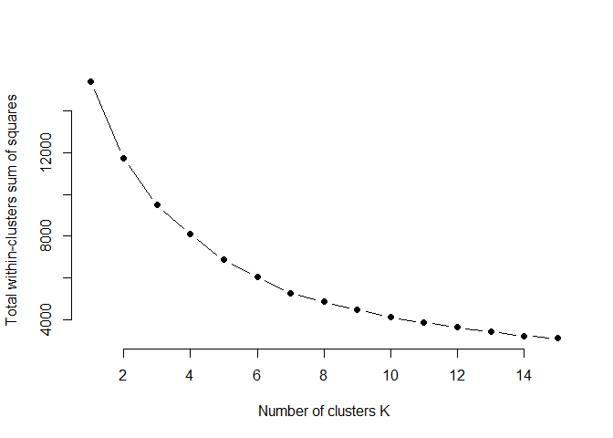
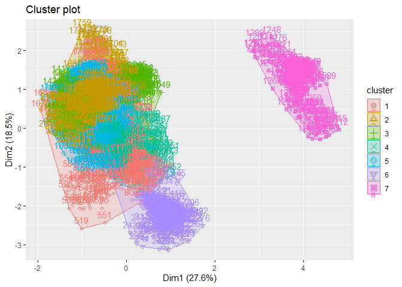

# **INSTRUCTIONS**

1.  Loading Necessary Libraries:

    ``` r
    library(tidyverse)
    ```

        ## ── Attaching core tidyverse packages ──────────────────────── tidyverse 2.0.0 ──
        ## ✔ dplyr     1.1.4     ✔ readr     2.1.5
        ## ✔ forcats   1.0.0     ✔ stringr   1.5.1
        ## ✔ ggplot2   3.5.1     ✔ tibble    3.2.1
        ## ✔ lubridate 1.9.3     ✔ tidyr     1.3.1
        ## ✔ purrr     1.0.2     
        ## ── Conflicts ────────────────────────────────────────── tidyverse_conflicts() ──
        ## ✖ dplyr::filter() masks stats::filter()
        ## ✖ dplyr::lag()    masks stats::lag()
        ## ℹ Use the conflicted package (<http://conflicted.r-lib.org/>) to force all conflicts to become errors

    ``` r
    library(cluster)
    library(factoextra)
    ```

        ## Welcome! Want to learn more? See two factoextra-related books at https://goo.gl/ve3WBa

    ``` r
    library(ggplot2)
    ```

2.  Loading the Data into Data named data frame:

    ``` r
    data <- read.csv("D:/Important Files Study/Crop Recommendation Dataset work/Crop_recommendation.csv")
    ```

3.  Removing the 'label' feature from the dataset:

    ``` r
    data <- data %>% select(-label)
    ```

4.  Scaling the features so it doesn't dominate other feature:

    ``` r
    data_scaled <- scale(data)
    #viewing dataset
    View(data)
    ```

5.  Determining the number of Clusters:

    ``` r
    #Setting seed 123 for reproductibilty
    set.seed(123)
    wss <- sapply(1:15, function(k){kmeans(data_scaled, k, nstart = 20)$tot.withinss})
    plot(1:15, wss, type="b", pch = 19, frame = FALSE, xlab="Number of clusters K", ylab="Total within-clusters sum of squares")
    ```

    

6.  Application of K-means cluster:

    ``` r
    set.seed(123)
    #value of K=7 taken analyzing from elbpow plot
    kmeans_result <- kmeans(data_scaled, centers = 7, nstart = 25)
    #Adding cluster infromation to the original data
    data$cluster <- as.factor(kmeans_result$cluster)
    ```

7.  Visualizing the Cluster:

    ``` r
    fviz_cluster(kmeans_result, data = data_scaled)
    ```

    
